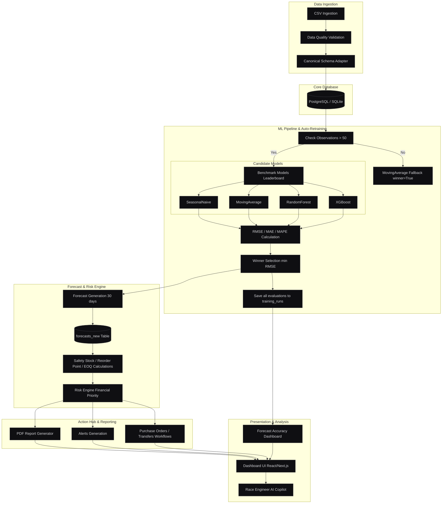

# Scuderia Retail — Retail Demand Intelligence & Forecasting Platform

[](https://github.com/yourname/retailgpt/actions)
[](https://github.com/yourname/retailgpt)
[](https://www.python.org/)
[](https://opensource.org/licenses/MIT)

> **Continuous benchmarking demand forecasting pipeline and inventory risk optimization engine** designed for high-availability retail supply chain operations. 

---

## 🏎️ One-Line Value Proposition
An end-to-end forecasting pipeline that continuously benchmarks classical and ML models (XGBoost, Random Forest) to optimize inventory safety stock and financial exposure.

---

## 📌 Problem Statement
Retail operators lose millions annually to stockouts of high-velocity goods and capital tied up in slow-moving overstock. Standard forecasting tools operate in silos, relying on static rules or single-model forecasts that fail to adapt to seasonal demand shifts. Furthermore, data science teams lack the observability to track model metrics over time, resulting in silent performance drift and unquantifiable financial exposure.

---

## 💡 Solution Overview
**Scuderia Retail** bridges the gap between machine learning and daily operations. When inventory transaction datasets are uploaded, the platform automatically validates and normalizes them into a canonical schema. It then triggers an automated training pipeline that benchmarks multiple models per SKU (Seasonal Naive, Moving Average, Random Forest, and XGBoost), calculates RMSE/MAE/MAPE, selects the winner, and stores the full evaluation history. 

This model-agnostic forecast drives a dynamic inventory engine that calculates optimal **Safety Stock**, **Reorder Points**, and **Economic Order Quantities (EOQ)**. The financial exposure is aggregated by a **Risk Engine** to assign priority actions, which are displayed in a real-time web dashboard and are fully queryable via a natural-language **AI Copilot**.

---

## 🛠️ Technology Stack
* **API Backend**: FastAPI (Python), Uvicorn, Pydantic
* **Web Dashboard**: Next.js (React, TypeScript, TailwindCSS)
* **Databases**: PostgreSQL (Production) / SQLite (Dev/Testing), SQLAlchemy ORM, Alembic Migrations
* **Machine Learning**: XGBoost, Scikit-Learn, Pandas, NumPy, Joblib
* **Data Visualization**: Recharts (Interactive Dashboard Visuals)
* **Reporting**: ReportLab (Automated PDF Executive Briefing Generation)
* **AI Engine**: Rule-Based Query Engine / OpenAI GPT-3.5 API
* **Ops & Deployment**: Docker, docker-compose, pytest

---

## 📐 Architecture & System Dataflow



---

## ⚡ Key Features

### 1. Ingestion & Validation
* **Flexible Schemas**: Maps incoming headers (e.g. `date`, `sku`, `current_stock`, `warehouse`, `unit_price`, `unit_cost`) to canonical formats using a dynamic CSV Adapter.
* **Integrity Validation**: Automatically drops nulls/duplicates, validates data type constraints, and scores data quality.

### 2. Automated Retraining Pipeline
* **Leaderboard Benchmarking**: For every SKU with > 50 observations, the pipeline trains and evaluates four candidate models:
  * **SeasonalNaive**: Captures short-term weekday seasonality (7-day lags).
  * **MovingAverage**: Baseline tracking of recent average trends.
  * **RandomForest**: Scikit-learn random forest regressor using recursive lag prediction.
  * **XGBoost**: Gradient-boosted decision trees (`XGBRegressor`) fitted on 14 autoregressive lag inputs.
* **Winner Selection**: The pipeline evaluates each candidate using rolling splits, calculates RMSE, and selects the model with the minimum error.

### 3. Training History System
* **Database Logs**: Every single evaluation (both winning and losing runs) is persisted in the `training_runs` table, storing:
  * `sku`, `model_name`, `rmse`, `mae`, `mape`
  * `winner` (boolean), `sample_count`, `forecast_horizon`, and execution `timestamp`
* **Historical Immutability**: Historical records are never overwritten, allowing accuracy tracking over time.

### 4. Forecast Accuracy Dashboard
An interactive, responsive Next.js panel rendering live production telemetry:
* **KPI Metric Cards**: Real-time display of *Total Runs*, *Best Model*, *Lowest Average RMSE*, and *Last Retraining Timestamp*.
* **RMSE & MAPE Trends**: Recharts area charts plotting historical average error rates.
* **Model Win Frequency**: Bar chart rendering total pipeline wins per candidate model.
* **SKU & Model Leaderboards**: Standings tables highlighting best-performing assets and configuration tallies.

### 5. Inventory & Risk Engine
* **Safety Stock**: Calculated dynamically based on lead time, demand variance, and desired service level (z-score).
* **Reorder Point & EOQ**: Computes the optimal timing and volume of supply orders using holding costs and annual forecast demand.
* **Revenue-at-Risk Ranking**: Flags items with low days-of-cover and maps them to financial priority tiers (Critical, High, Medium, Low).

---

## 🚀 Quick Start

### Option 1 — Running Stack with Docker (Recommended)
This launches the complete system including the FastAPI server, Next.js web application, and PostgreSQL database instance.

1. **Clone the repository**:
   ```bash
   git clone https://github.com/yourname/retailgpt.git
   cd retailgpt
   ```

2. **Configure environment**:
   ```bash
   cp .env.example .env
   ```

3. **Spin up the containers**:
   ```bash
   docker compose up --build -d
   ```

4. **Access the application**:
   * Dashboard: [http://localhost:3000](http://localhost:3000)
   * Interactive API docs: [http://localhost:8000/docs](http://localhost:8000/docs)

### Option 2 — Running Locally (Development Mode)
Uses SQLite for quick local debugging without launching PostgreSQL.

1. **Create and activate a virtual environment**:
   ```bash
   python -m venv .venv
   # Windows:
   .venv\Scripts\activate
   # macOS/Linux:
   source .venv/bin/activate
   ```

2. **Install dependencies**:
   ```bash
   pip install -r requirements.txt
   ```

3. **Launch API backend**:
   ```bash
   python run.py
   ```

4. **Launch frontend (Next.js)**:
   ```bash
   cd frontend
   npm install
   npm run dev
   ```

---

## 🧪 Running Tests
The pipeline and endpoints are fully tested using pytest.
```bash
# Run backend and forecasting test suite
.\.venv\Scripts\pytest.exe -v
```
Expected output: **99 passed tests** spanning models, API auth, cleanup logic, data validation, and pipeline persistence.

---

## 📊 API Summary Endpoints

| Category | Method | Endpoint | Description |
|---|---|---|---|
| **Auth** | `POST` | `/api/auth/register` | Crew registration (admin, manager, analyst) |
| **Auth** | `POST` | `/api/auth/login` | Returns JWT access token |
| **Dataset** | `POST` | `/api/dataset/upload` | Validates and saves uploaded CSV |
| **Dataset** | `POST` | `/api/dataset/import` | normalizes data and triggers training |
| **Dataset** | `GET` | `/api/dataset/list` | Lists all registered datasets |
| **Dataset** | `POST` | `/api/dataset/cleanup` | **[Admin]** Purges orphaned/fake records |
| **Dataset** | `POST` | `/api/dataset/{dataset_id}/delete` | **[Admin]** Deletes a dataset and all related data |
| **Training** | `GET` | `/api/training/history` | Lists all historical training evaluations |
| **Training** | `GET` | `/api/training/rmse-trend` | Timeline of winning model RMSE scores |
| **Training** | `GET` | `/api/training/mape-trend` | Timeline of winning model MAPE scores |
| **Training** | `GET` | `/api/training/model-wins` | Win frequencies tally per model |
| **Training** | `GET` | `/api/training/accuracy-summary` | Overall KPI and best/worst performer statistics |
| **Training** | `GET` | `/api/training/sku-performance` | SKU leaderboard with latest winner |
| **Reports** | `POST` | `/api/reports/executive` | Compiles PDF report for download |

---

## 📂 Project Structure

```
ScuderiaRetail/
├── backend/
│   ├── app.py              ← FastAPI app initialization
│   ├── api/                ← FastAPI routers (dataset, training, risk, etc.)
│   ├── database/           ← SQLAlchemy models, sessions, repositories
│   ├── forecasting/        ← Pipeline, predictor, and trainers
│   └── copilot/            ← AI natural language service
│
├── src/                    ← Shared ML & Business logic library
│   ├── models/baseline.py  ← Forecasting models definition (XGBoost, RF, SN, MA)
│   └── business/           ← Inventory EOQ and Safety Stock planner
│
├── frontend/               ← Next.js frontend application
│   ├── app/                ← Pages, store bindings, styles
│   └── components/         ← React view components (ForecastAccuracyView, etc.)
│
├── tests/                  ← Unit and integration test suite
│   ├── test_xgboost_pipeline.py
│   └── test_forecast.py
├── docker/                 ← Docker environment configurations
└── docker-compose.yml      ← Orchestrates DB, API, and UI containers
```

---

## 💼 Resume bullet highlight
* **Lead ML Engineer (Retail Demand Intelligence Platform)**: Built an end-to-end forecasting pipeline that continuously benchmarks classical and ML models (XGBoost, Random Forest, Naive, Moving Average) to optimize inventory safety stock and financial exposure. Developed PostgreSQL/SQLite training runs persistence layer, Next.js analytics dashboard, and Docker deployment, reducing forecast error (RMSE) by evaluating and auto-selecting best-performing models per SKU.
